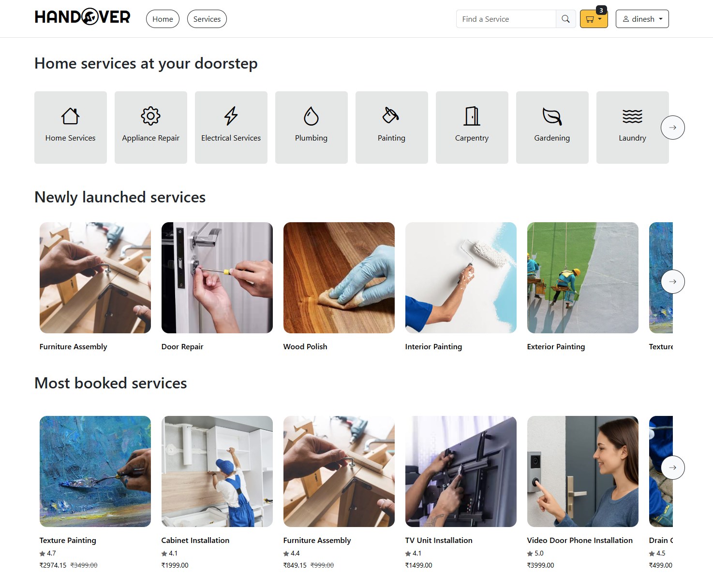
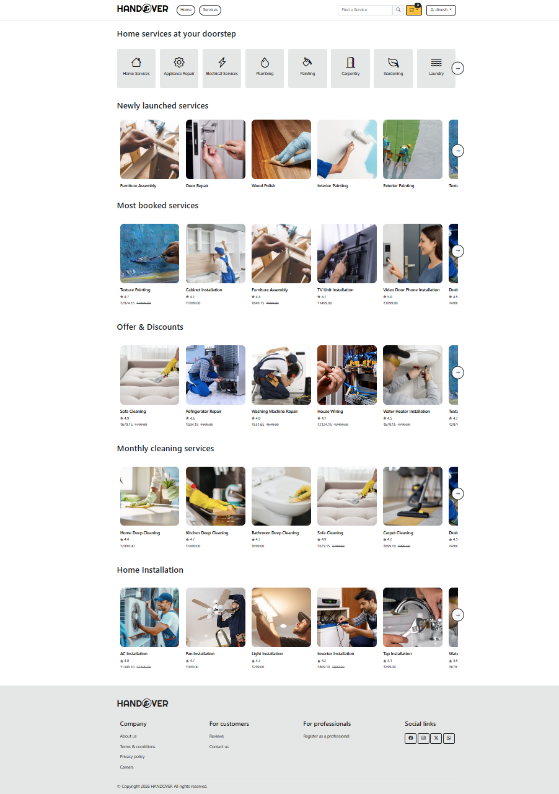
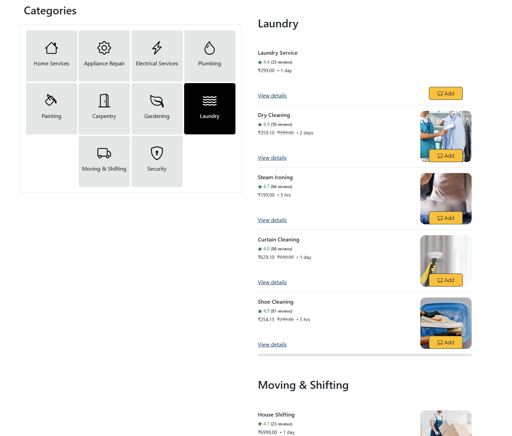
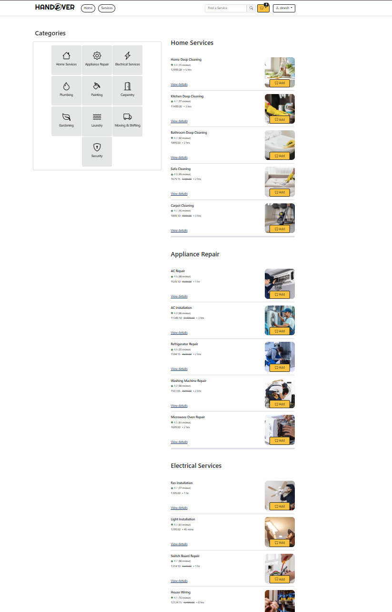
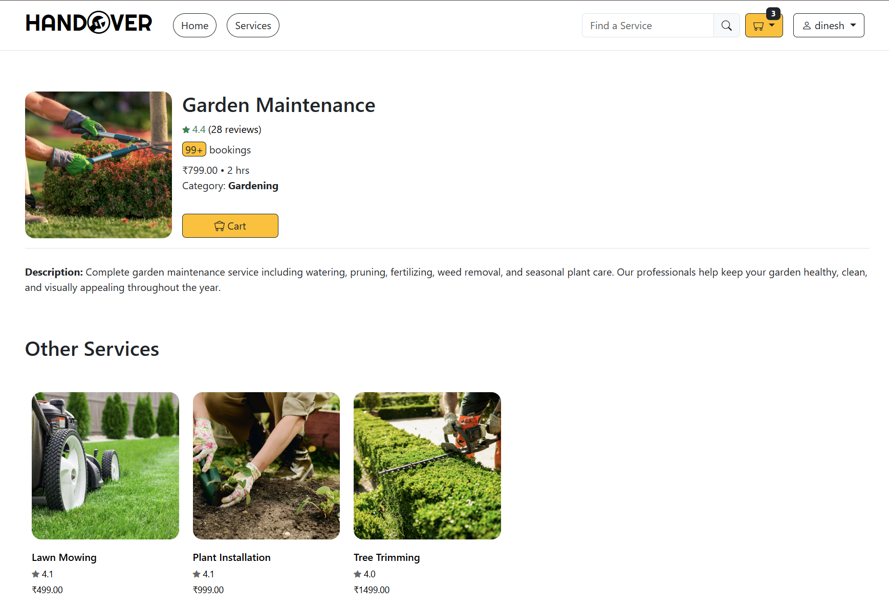
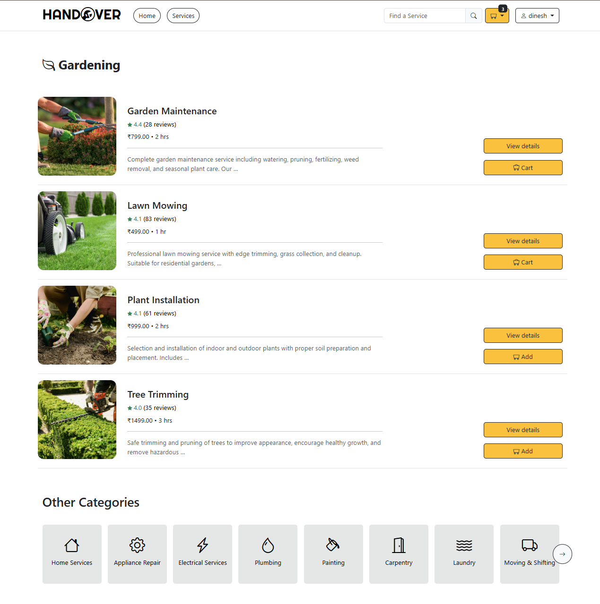
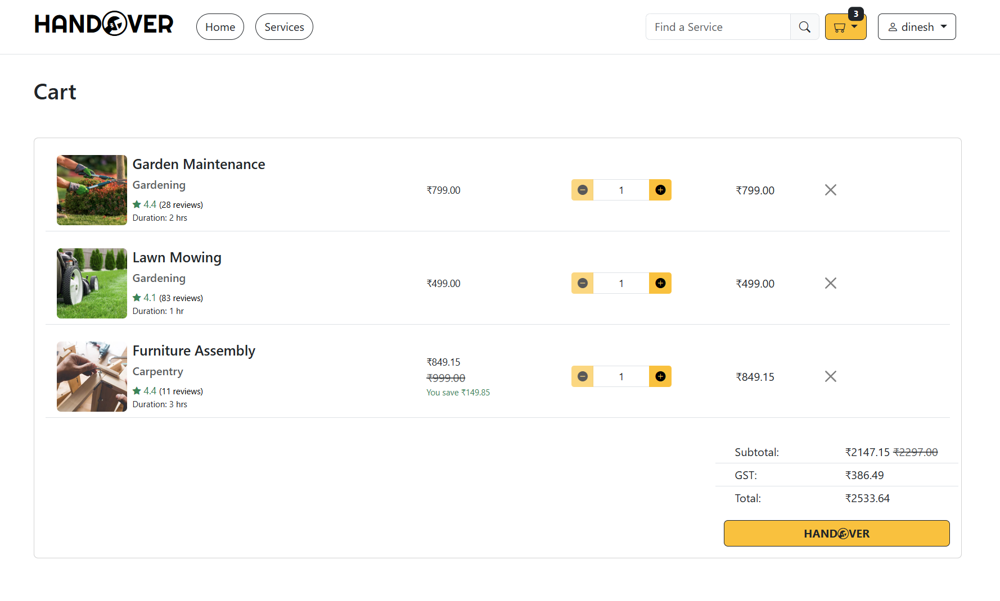
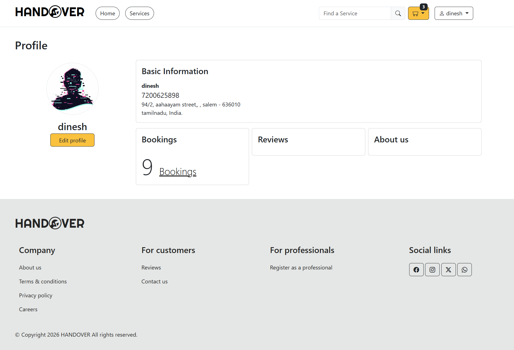
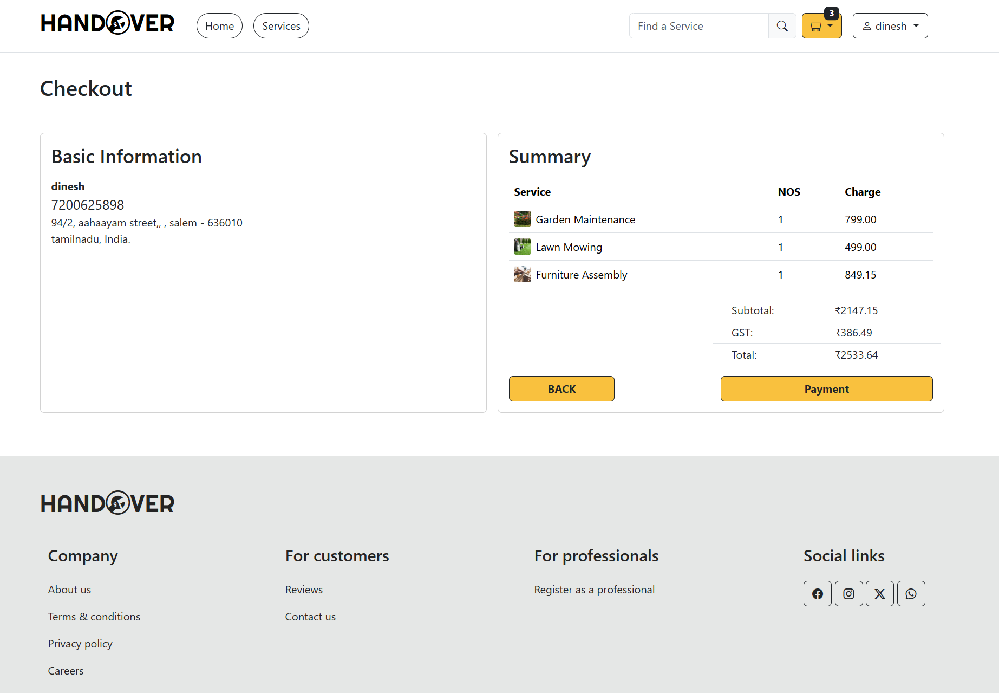
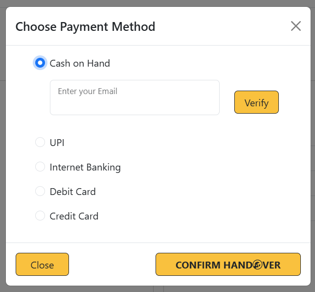

# HANDOVER

A full-stack service booking web application built with Django, SQLite, HTML, CSS, Bootstrap, and JavaScript. The application allows users to browse services, manage their profiles, add services to a cart, update cart items dynamically, and confirm orders.

## Features

### User Authentication & Profile

* User registration and login
* User authentication
* User profile page
* Update user address
* Upload and update profile picture

### Services

* Browse available services
* View services across multiple categories
* Display newly added services
* Display discounted services
* Display most-booked services
* Navigate between related services and categories
* Interconnected service links for easier navigation

### Dynamic Cart System

Users can manage their cart without continuously reloading the page.

* Add services to cart
* View cart
* Update cart items
* Delete cart items
* Display the total number of cart items
* Mini-cart dropdown
* Dynamically update cart information using JavaScript
* Calculate:

  * Subtotal
  * Discount
  * Tax
  * Total amount

### Order Management

* Review cart before placing an order
* Confirm order
* Store order information in the database
* Display order success confirmation
* Send an order confirmation email to the user

### Dynamic Frontend

JavaScript `fetch()` requests are used to communicate with Django backend endpoints and update parts of the interface dynamically without requiring a full page reload.

## Technologies Used

### Frontend

* HTML5
* CSS3
* Bootstrap
* JavaScript
* Fetch API

### Backend

* Python
* Django
* Django ORM

### Database

* SQLite

## Project Structure

```text
HANDOVER/
├── app/
├── templates/
├── static/
│   ├── css/
│   ├── js/
│   └── images/
├── media/
├── manage.py
├── db.sqlite3
└── README.md
```

> The project structure above is an example. Update it to match the actual structure of the project.

## Database

The application uses **SQLite** as its database and **Django ORM** for creating, retrieving, updating, and deleting application data.

The database handles information such as:

* Users
* User profiles
* Services
* Categories
* Cart items
* Orders
* Order details

## Dynamic Cart Workflow

The cart system works dynamically using JavaScript and Django.

```text
User Action
    ↓
JavaScript Fetch Request
    ↓
Django View
    ↓
Django ORM
    ↓
SQLite Database
    ↓
JSON Response
    ↓
JavaScript Updates UI
```

For example, when a user adds a service to the cart, the frontend sends a `fetch()` request to the Django backend. Django processes the request through the ORM, updates the database, and returns the result to the frontend. The cart count and mini-cart can then be updated without refreshing the entire page.

## Installation

### 1. Clone the repository

```bash
git clone <your-repository-url>
```

### 2. Navigate to the project directory

```bash
cd HANDOVER
```

### 3. Create a virtual environment

```bash
python -m venv .venv
```

### 4. Activate the virtual environment

Windows:

```bash
.venv\Scripts\activate
```

### 5. Install the required dependencies

```bash
pip install -r requirements.txt
```

### 6. Apply database migrations

```bash
python manage.py migrate
```

### 7. Start the development server

```bash
python manage.py runserver
```

Open the application in your browser:

```text
http://127.0.0.1:8000/
```

## Screenshots

### Home Page





### Services





### Service Page



### Category Page



### Cart



### User Profile



### Order Confirmation



### Payment Methods




## What I Learned

Through this project, I practiced building a full-stack web application using Django and JavaScript.

Key concepts I practiced include:

* Django project and application structure
* Django models and ORM
* SQLite database management
* User authentication
* User profile management
* User booking history
* Order history
* File and image handling
* Django views and URL routing
* Django templates
* CRUD operations
* JavaScript `fetch()` API
* Sending and handling JSON responses
* CSRF handling for AJAX requests
* Dynamic DOM updates
* Cart management
* Database relationships
* Order processing
* Email integration
* Responsive UI development with Bootstrap

## Future Improvements

The project can be extended with additional features such as:

* Service/product search
* Advanced service filtering
* Service sorting
* Online payment integration
* Service reviews and ratings
* Real-time notifications
* Improved email templates
* Deployment to a cloud platform

## Author

**Dinesh**

GitHub: [itz-ds](https://github.com/itz-ds)
